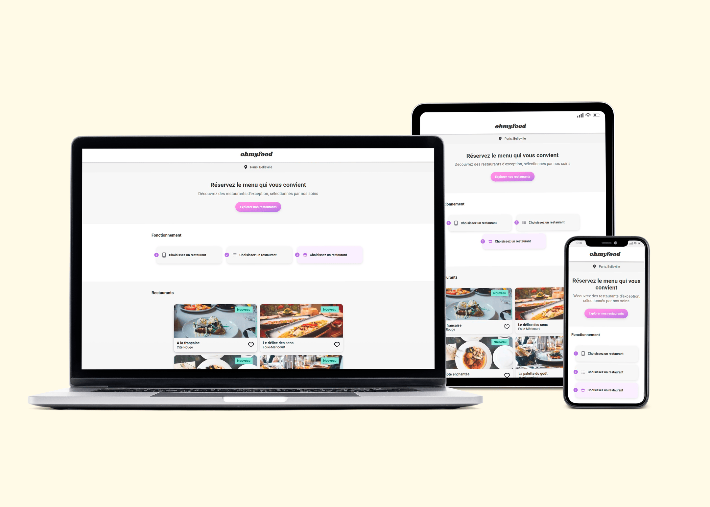
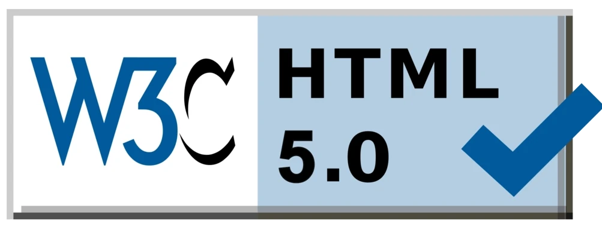

<h3 align="center">
	Troisième projet du parcours "Développeur web" chez OpenClassroom.
</h3>

## **Presentation**

Ohmyfood! est une entreprise de commande de repas en ligne. Notre concept permet aux
utilisateurs de composer leur propre menu et réduire leur temps d’attente dans les
restaurants car leur menu est préparé à l’avance. Plus de perte de temps à consulter la carte
!
 
[Lien vers le site](https://jzmirou.github.io/OhmyFood/)

## **Technologies**

 
	
	
	
	

## **Identité graphique**

### **Polices :**

-   **Logo & titres:** Shrinkhand
-   **Texte: Roboto:** Roboto

### **Couleurs :**

-   **Primaire:** #9356DC 
-   **Secondaire:** #FF79DA 
-   **Tertiaire:** #99E2D0 

## **Lighthouse PageSpeed Insights**

\

## **W3C Validateur**

## **Auteurs**

<b>
<table>
	<tbody>
		<tr>
			<td align="center">
				
				 
				Jeremy Zmirou
				 
				
				
				
				
			</td>
		</tr>
	</tbody>
</table>

## :dart: Objectifs attendus

-   Développer un site proposant le menu de **4 grands restaurants parisiens**
-   Les **animations** devront se faire en **CSS**, sans JavaScript
-   Utiliser **SASS** serait un plus
-   L’ensemble du site devra être **responsive** sur mobile, tablette et desktop
-   Les pages devront passer la **validation W3C** en HTML et CSS sans erreur
-   Le site doit être parfaitement **compatible** avec les dernières versions desktop de **Chrome** et **Firefox**

## :white_check_mark: Compétences évaluées

-   Intégrer une maquette en mobile-first
-   Mettre en œuvre des animations CSS
-   Versionner son projet avec Git et Github
